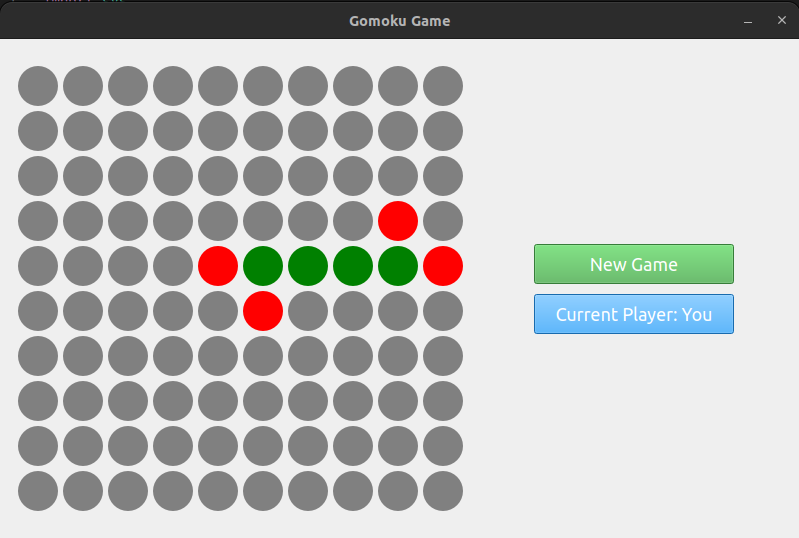

# Gomoku Game

## Description

This is a simple 10x10 Gomoku (also known as Five in a Row) game implemented in Python 3 using the PyQt5 library. Gomoku is a two-player strategy board game where the objective is to be the first to get five of your stones in a row, horizontally, vertically, or diagonally.



## Installation

To play the game, you'll need to have Python 3 installed on your system. If you don't have it installed, you can download it from the official Python website: [Python Downloads](https://www.python.org/downloads/).

### Clone the Repository

Clone this repository to your local machine using Git:

```git clone https://github.com/jubaerhosain/gomoku.git```

### Install Dependencies

Navigate to the project directory:

```cd gomoku```

Install the game's dependencies using the requirements.txt file:

```pip3 install -r requirements.txt```

## Running the Game

Once you have Python 3 and the dependencies installed, you can run the Gomoku game:

```python3 gomoku.py```

## How to Play
1. To make a move, click on an empty cell on the game board.
2. The game alternates between the two players(You and AI), and the goal is to get five stones in a row before your opponent does.